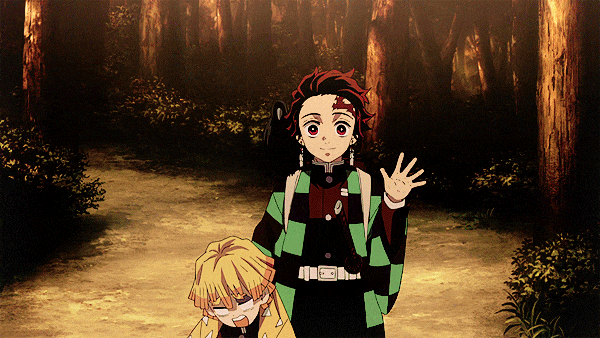
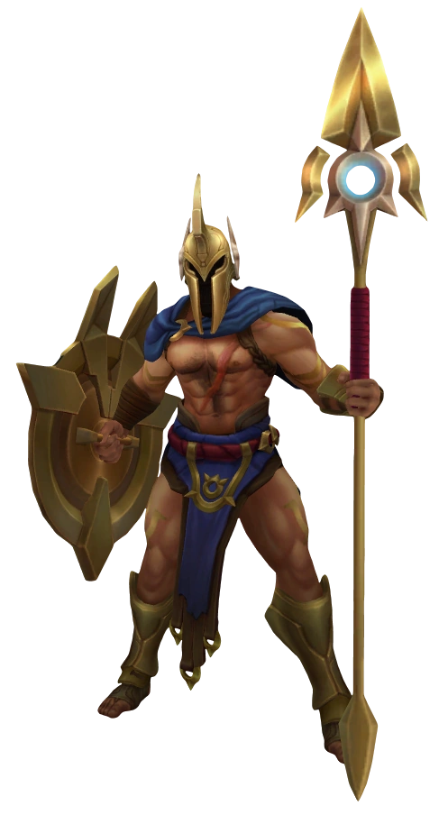
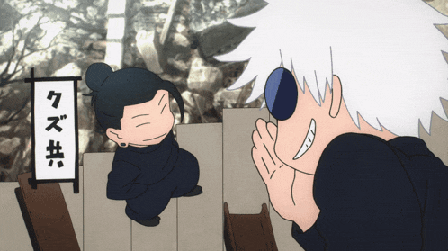

<body>

<h2 align="center"> 🦾 About me 👾 </h2>
 

- Computer engineer. 🖥️
- 🔭 I’m currently working on my dreams, my personal and professional growth.
- 🌱 I’m currently learning Swift, Python, CSS, HTML, and JavaScript.
- 🤔 I’m looking for help with improving my skills as a developer.
- 💬 Ask me about my pets.
- 📫 How to reach me: [Facebook](https://www.facebook.com/francisco.reynoso00/), Instagram: [FranciscoBlue_Ortega](https://www.instagram.com/franciscoblue_ortega/).
- 😄 I like to be called Frank or Javi.
- ⚡ Fun fact: I love tacos 🌮.
- 😉 You only fail when you stop trying.
- I am a pre intern at Proteco. 💻

## 
 Favorites Programming Languages 

  

  

 

- Java Script
- C/C++
- Java
- Shellscript
- Python

<h2 align="center"> Currently learning</h2>

  

<footer align="center">
  <h2 align="center">
    *********Thanks for being here*********
  </h2> 

  
</footer>
